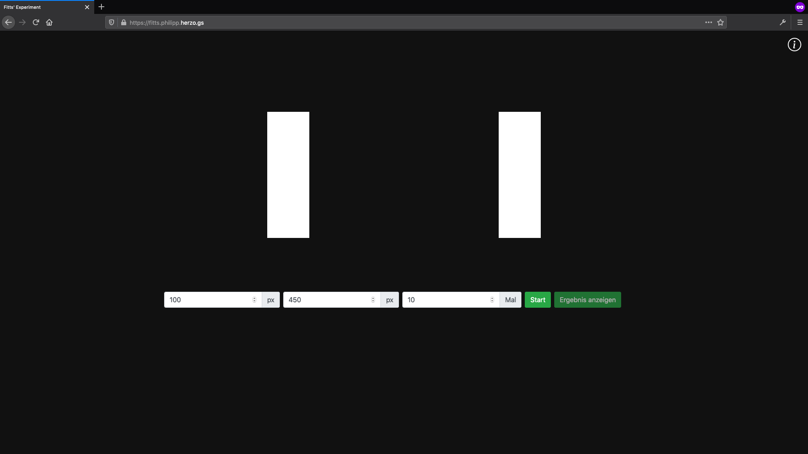

# Fitts' Experiment

VueJS web application to perform a simple experiment regarding fitts law. The user has to click different sized bars as fast as possible. The time between two clicks is measured.

After the experiment the local data can be exported as `.csv`.

[Try it yourself](https://fitts.philipp.herzo.gs/)

## Screenshots




## Project setup
```
npm install
```

### Compiles and hot-reloads for development
```
npm run serve
```

### Compiles and minifies for production
```
npm run build
```

### Lints and fixes files
```
npm run lint
```

### Customize configuration
See [Configuration Reference](https://cli.vuejs.org/config/).
